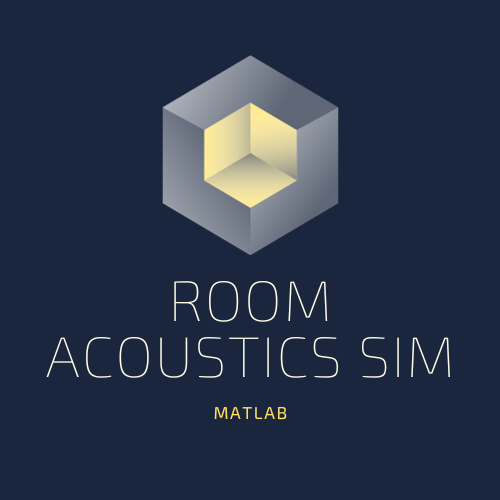
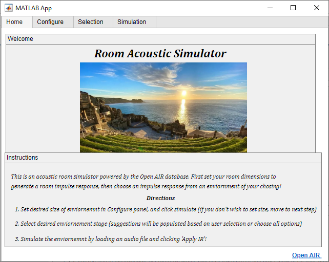
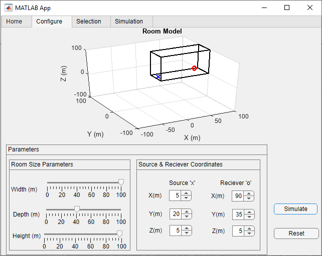
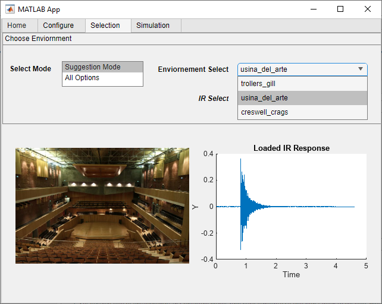
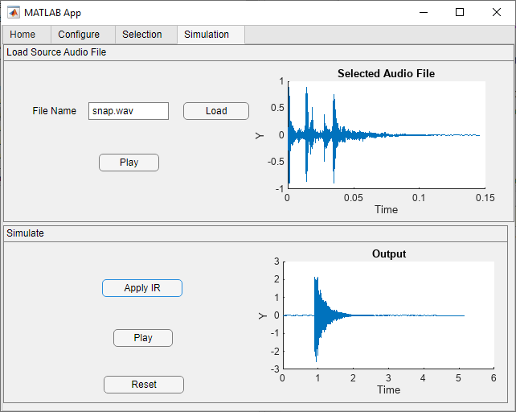

<!-- Improved compatibility of back to top link: See: https://github.com/othneildrew/Best-README-Template/pull/73 -->
<a name="readme-top"></a>
<!--
*** Thanks for checking out the Best-README-Template. If you have a suggestion
*** that would make this better, please fork the repo and create a pull request
*** or simply open an issue with the tag "enhancement".
*** Don't forget to give the project a star!
*** Thanks again! Now go create something AMAZING! :D
-->


<!-- PROJECT SHIELDS -->
<!--
*** I'm using markdown "reference style" links for readability.
*** Reference links are enclosed in brackets [ ] instead of parentheses ( ).
*** See the bottom of this document for the declaration of the reference variables
*** for contributors-url, forks-url, etc. This is an optional, concise syntax you may use.
*** https://www.markdownguide.org/basic-syntax/#reference-style-links
-->
[![Contributors][contributors-shield]][contributors-url]
[![Forks][forks-shield]][forks-url]
[![Stargazers][stars-shield]][stars-url]
[![Issues][issues-shield]][issues-url]
[![MIT License][license-shield]][license-url]
[![LinkedIn][linkedin-shield]][linkedin-url]


<!-- PROJECT LOGO -->
<br />
<div align="center">
  <a href="https://github.com/shyamal10/RoomAcousticSim">
    
  </a>

<h3 align="center">Room Acoustics Simulator</h3>

  <p align="center">
    A room acoustic simulator with configurable source/receiver locations and room dimensions. App was designed using MATLAB's app designer. No external packages required.
    <br />
    <a href="https://github.com/shyamal10/RoomAcousticSim"><strong>Explore the docs »</strong></a>
    <br />
    <br />
    <a href="https://github.com/shyamal10/RoomAcousticSim">View Demo</a>
    ·
    <a href="https://github.com/shyamal10/RoomAcousticSim/issues">Report Bug</a>
    ·
    <a href="https://github.com/shyamal10/RoomAcousticSim/issues">Request Feature</a>
  </p>
</div>


<!-- TABLE OF CONTENTS -->
<details>
  <summary>Table of Contents</summary>
  <ol>
    <li>
      <a href="#about-the-project">About The Project</a>
      <ul>
        <li><a href="#built-with">Built With</a></li>
      </ul>
    </li>
    <li>
      <a href="#getting-started">Getting Started</a>
      <ul>
        <li><a href="#prerequisites">Prerequisites</a></li>
        <li><a href="#installation">Installation</a></li>
      </ul>
    </li>
    <li><a href="#usage">Usage</a></li>
    <li><a href="#roadmap">Roadmap</a></li>
    <li><a href="#contributing">Contributing</a></li>
    <li><a href="#license">License</a></li>
    <li><a href="#contact">Contact</a></li>
    <li><a href="#acknowledgments">Acknowledgments</a></li>
  </ol>
</details>


<!-- ABOUT THE PROJECT -->
## About The Project

<!-- PROJECT Home page -->
<br />
<div align="center">
  <a href="https://github.com/shyamal10/RoomAcousticSim">
    
  </a>

Welcome to the Room Acoustics Simulator! Begin by configuring your room dimensions and source/receiver parameters. Our suggestion algorithm will then analyze your settings and recommend environments from our extensive database that closely match your criteria. You have the option to select from the suggested environments or pick from a library of over 17 distinct acoustic environments from around the world, powered by Open AIR. Additionally, you can import your own audio file to serve as the source sound. Our advanced signal processing techniques, including stochastic ray tracing and the application of room impulse responses, will be used to generate a final output signal that you can play and experience as if you are in the specified locations.


<p align="right">(<a href="#readme-top">back to top</a>)</p>


### Built With

* [![MATLAB][mathworks.com]][mathworks-url]

<p align="right">(<a href="#readme-top">back to top</a>)</p>


<!-- GETTING STARTED -->
## Getting Started

This is an example of how you may give instructions on setting up your project locally.
To get a local copy up and running follow these simple example steps.

### Prerequisites

To execute any MATLAB program on a computer without MATLAB installed, you must first install the Matlab Compiler Runtime (MCR). 
This is essential as it includes the core Matlab functionality needed by your application, on the target machine where you intend 
to deploy your application. Ensure that you install the same version of MCR as the version of Matlab was used to generate this program.
This app was built using MATLAB version 2023a so the MCR version would be 9.14. If MATLAB is installed,
verify that MATLAB Runtime(R2023a) is installed. If not, you can run the MATLAB Runtime installer.
To find its location, enter
  
    >>mcrinstaller
      
at the MATLAB prompt.
NOTE: You will need administrator rights to run the MATLAB Runtime installer. 

Alternatively, download and install the Windows version of the MATLAB Runtime for R2023a 
from the following link on the MathWorks website:

    https://www.mathworks.com/products/compiler/mcr/index.html
   
For more information about the MATLAB Runtime and the MATLAB Runtime installer, see 
"Distribute Applications" in the MATLAB Compiler documentation  
in the MathWorks Documentation Center.


If you have MATLAB and App designer simply clone the repo in your MATLAB files directory
   ```sh
   git clone https://github.com/shyamal10/RoomAcousticSim.git
   ```
And run the .mlapp file.


### Installation (if MATLAB is not installed)


1. Download MATLAB Runtime 9.14 at link [[MCR](https://www.mathworks.com/products/compiler/matlab-runtime.html)]
2. Follow installation instructions
3. Run exe file found in releases 

<p align="right">(<a href="#readme-top">back to top</a>)</p>


<!-- USAGE EXAMPLES -->
## Usage

Configuration: 
<!-- PROJECT config page -->
<br />
<div align="center">
  <a href="https://github.com/shyamal10/RoomAcousticSim">
    
  </a>
<br />
  
\Here you can set the dimensions of your room. You can also set where your source is and where your reciever position is, to best model how you want your final image to be.
When you click simulate, a Room impulse response is generated using Stochastic Tracing methods 

Selection:
<!-- PROJECT config page -->
<br />
<div align="center">
  <a href="https://github.com/shyamal10/RoomAcousticSim">
    
  </a> 
<br />
An algorithm for providing recommendations is applied based on user configurations. This allows users to select from a variety of environments that best match their specific settings. Images and impulse responses are dynamically updated with each selection made. Additionally, users have the option to explore all available environments through the "all options" tab, which displays the entire database of environments.
  
All impulse responses (IRs) are sourced from the Open AIR's database, accessible directly within the application or via the references tab at the bottom of the page. Furthermore, environments may offer multiple IRs for selection. Users can choose from a dropdown menu to switch between them, observing real-time updates in the response plots.


Simulation:
<!-- PROJECT config page -->
<br />
<div align="center">
  <a href="https://github.com/shyamal10/RoomAcousticSim">
    
  </a> 
<br />
You can upload your audio file here and view a real-time plot. This file serves as the 'source' that you previously placed in the app's configuration panel. When you click "simulate," both impulse responses are applied to the signal, which is visible in the "Applied IR" plots and can be played back. If needed, you can reset all fields from this point to start over.

  
_For more examples, please refer to the [Documentation](https://example.com)_

<p align="right">(<a href="#readme-top">back to top</a>)</p>


<!-- ROADMAP -->
## Possible updates

- [ ] Expand current database of IR's around the world to broaden the app's scope and capabilities.
- [ ] Performance Optimization
- [ ] Configuring customizable reflectivity and wall properties to offer a more immersive and realistic audio simulation experience.

See the [open issues](https://github.com/shyamal10/RoomAcousticSim/issues) for a full list of proposed features (and known issues).

<p align="right">(<a href="#readme-top">back to top</a>)</p>


<!-- CONTRIBUTING -->
## Contributing

Contributions are what make the open source community such an amazing place to learn, inspire, and create. Any contributions you make are **greatly appreciated**.

If you have a suggestion that would make this better, please fork the repo and create a pull request. You can also simply open an issue with the tag "enhancement".
Don't forget to give the project a star! Thanks again!

1. Fork the Project
2. Create your Feature Branch (`git checkout -b feature/AmazingFeature`)
3. Commit your Changes (`git commit -m 'Add some AmazingFeature'`)
4. Push to the Branch (`git push origin feature/AmazingFeature`)
5. Open a Pull Request

<p align="right">(<a href="#readme-top">back to top</a>)</p>


<!-- LICENSE -->
## License

Distributed under the MIT License. See `LICENSE.txt` for more information.

<p align="right">(<a href="#readme-top">back to top</a>)</p>


<!-- CONTACT -->
## Contact

Shyamal Singh - shyamal.p.singh@gmail.com

Project Link: [https://github.com/shyamal10/RoomAcousticSim](https://github.com/shyamal10/RoomAcousticSim)

<p align="right">(<a href="#readme-top">back to top</a>)</p>


<!-- ACKNOWLEDGMENTS -->
## Acknowledgments

* []()McGovern, Stephen G. “Fast image method for impulse response calculations of box-shaped rooms.” Applied Acoustics, vol. 70, no. 1, 2009, pp. 182–189, https://doi.org/10.1016/j.apacoust.2008.02.003. 
* []()https://www.mathworks.com/help/audio/ug/room-impulse-response-simulation-with-image-source-method-and-hrtf-interpolation.html
* []()https://www.mathworks.com/help/audio/ug/room-impulse-response-simulation-with-stochastic-ray-tracing.html
* []() https://www.openairlib.net/

<p align="right">(<a href="#readme-top">back to top</a>)</p>


<!-- MARKDOWN LINKS & IMAGES -->
<!-- https://www.markdownguide.org/basic-syntax/#reference-style-links -->
[contributors-shield]: https://img.shields.io/github/contributors/shyamal10/RoomAcousticSim.svg?style=for-the-badge
[contributors-url]: https://github.com/shyamal10/RoomAcousticSim/graphs/contributors
[forks-shield]: https://img.shields.io/github/forks/shyamal10/RoomAcousticSim.svg?style=for-the-badge
[forks-url]: https://github.com/shyamal10/RoomAcousticSim/network/members
[stars-shield]: https://img.shields.io/github/stars/shyamal10/RoomAcousticSim.svg?style=for-the-badge
[stars-url]: https://github.com/shyamal10/RoomAcousticSim/stargazers
[issues-shield]: https://img.shields.io/github/issues/shyamal10/RoomAcousticSim.svg?style=for-the-badge
[issues-url]: https://github.com/shyamal10/RoomAcousticSim/issues
[license-shield]: https://img.shields.io/github/license/shyamal10/RoomAcousticSim.svg?style=for-the-badge
[license-url]: https://github.com/shyamal10/RoomAcousticSim/blob/master/LICENSE.txt
[linkedin-shield]: https://img.shields.io/badge/-LinkedIn-black.svg?style=for-the-badge&logo=linkedin&colorB=555
[linkedin-url]: https://www.linkedin.com/in/shyamal-singh-5225591a3/
[product-screenshot]: images/screenshot.png
[Next.js]: https://img.shields.io/badge/next.js-000000?style=for-the-badge&logo=nextdotjs&logoColor=white
[Next-url]: https://nextjs.org/
[React.js]: https://img.shields.io/badge/React-20232A?style=for-the-badge&logo=react&logoColor=61DAFB
[React-url]: https://reactjs.org/
[Vue.js]: https://img.shields.io/badge/Vue.js-35495E?style=for-the-badge&logo=vuedotjs&logoColor=4FC08D
[Vue-url]: https://vuejs.org/
[Angular.io]: https://img.shields.io/badge/Angular-DD0031?style=for-the-badge&logo=angular&logoColor=white
[Angular-url]: https://angular.io/
[Svelte.dev]: https://img.shields.io/badge/Svelte-4A4A55?style=for-the-badge&logo=svelte&logoColor=FF3E00
[Svelte-url]: https://svelte.dev/
[Laravel.com]: https://img.shields.io/badge/Laravel-FF2D20?style=for-the-badge&logo=laravel&logoColor=white
[Laravel-url]: https://laravel.com
[Bootstrap.com]: https://img.shields.io/badge/Bootstrap-563D7C?style=for-the-badge&logo=bootstrap&logoColor=white
[Bootstrap-url]: https://getbootstrap.com
[mathworks.com]: https://img.shields.io/badge/MATLAB-28282B?style=for-the-badge&logo=matlab&logoColor=white
[mathworks-url]: https://www.mathworks.com/
[JQuery.com]: https://img.shields.io/badge/jQuery-0769AD?style=for-the-badge&logo=jquery&logoColor=white
[JQuery-url]: https://jquery.com 
